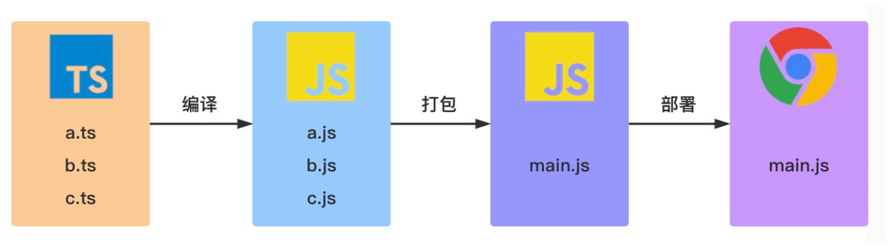

##### ⼀、TypeScript 是什么
1、TypeScript 是⼀种由微软开发的⾃由和开源的编程语⾔。它是 JavaScript 的⼀个超集，⽽且本质上向这
个语⾔添加了可选的静态类型和基于类的⾯向对象编程。

1.1 TypeScript 与 JavaScript 的区别

TypeScript| Javascript|
----------|-----------|
TypeScript 的超集⽤于解决⼤型项⽬的代码复杂性| ⼀种脚本语⾔，⽤于创建动态⽹⻚
可以在编译期间发现并纠正错误|作为⼀种解释型语⾔，只能在运⾏时发现错误
强类型，⽀持静态和动态类型|弱类型，没有静态类型选项
最终被编译成 JavaScript 代码，使浏览器可以理解| 可以直接在浏览器中使⽤
⽀持模块、泛型和接⼝| 不⽀持模块，泛型或接⼝
社区的⽀持仍在增⻓，⽽且还不是很⼤| ⼤量的社区⽀持以及⼤量⽂档和解决问题的⽀持

1.2 TypeScript ⼯作流程

